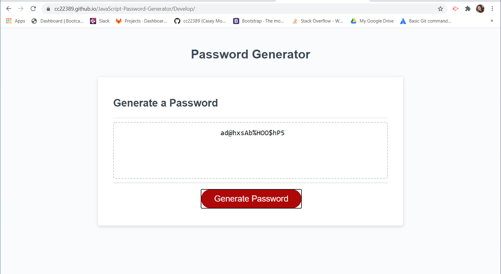

# JavaScript: Password Generator

This webpage prompts the user with various questions. Based on the users answers, the webpage will generate a random password for the user to keep. 

# Links

https://cc22389.github.io/JavaScript-Password-Generator/Develop/

https://github.com/cc22389/Password-Generator.git
